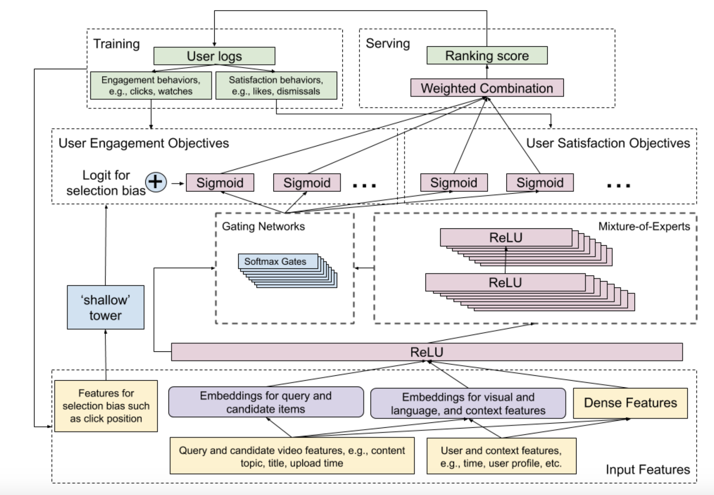

# [Recommending What Video to Watch Next: A Multitask Ranking System](https://dl.acm.org/doi/10.1145/3298689.3346997)

## data in paper:
- video: video meta-data and video content signals as its representation
- context: user demographics, device, time, and location
## Steps:
1. Generate candidtae models
2. ranking:
    - should be very efficient
    - model:
        - input: given a query, candidate, and context
        - output: predict the probability of user taking actions asuch as clicks, watches, likes and dismissals
    - measure:
        engagement objects: binary classifcation: user click; regress:  time spent
        satisfaction: binary classficatioin: like or not; regression: rating
    - loss:
        - binary classification: cross entropy loss
        - regression task: squared loss

3. implicit bias:  selection bias(ranking order decided by current system) => shallow tower => a scalar serving as a bias term to the final prediction of the main model

## data used in this repo from [here](https://github.com/youtube-dataset/conspiracy)
** Note **: only for testing model structure, training data in ranking.py is manipulated and not correct.

